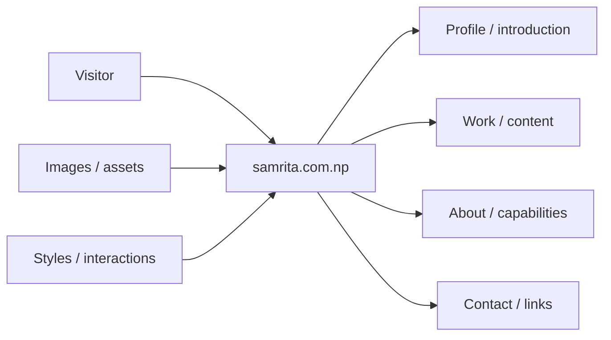
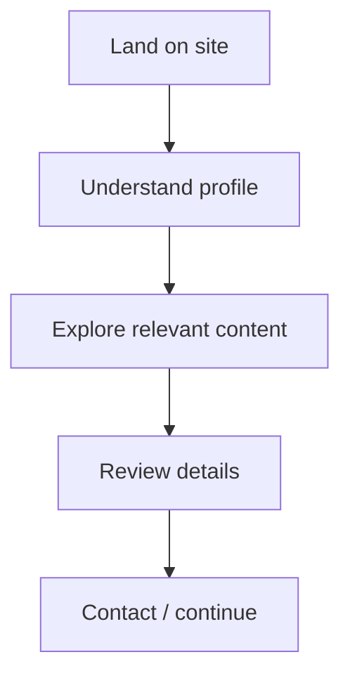
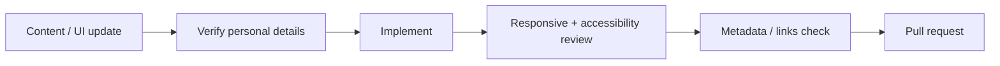

<div align="center">

# samrita.com.np

**A personal website project for presenting Samrita's profile, work, content, and contact information through a clear responsive experience.**


[Browse source](https://github.com/Nischhalsubba/samrita.com.np/tree/main) · [Issues](https://github.com/Nischhalsubba/samrita.com.np/issues)

</div>

## Overview

**samrita.com.np** is documented as a personal web presence. The experience should make identity, relevant work or content, and contact paths easy to understand for visitors while remaining maintainable for developers and designers.

<details open>
<summary><strong>🏗️ Interactive website architecture</strong></summary>



</details>

## Visitor flow



## Audience guide

| Audience | Focus |
|---|---|
| Visitors | Profile, content and contact |
| Developers | Structure, behavior, assets and delivery |
| Designers | Hierarchy, responsive behavior and accessibility |
| Content owner | Accurate personal information, media, links and metadata |

## Getting started

```bash
git clone https://github.com/Nischhalsubba/samrita.com.np.git
cd samrita.com.np
```

Use the manifests and lockfiles in the repository to determine current setup commands.

## Design & accessibility

Keep navigation predictable, typography readable, focus visible, layouts responsive, images meaningful, and motion respectful of user preferences. Personal information should be published intentionally and reviewed before deployment.

## SEO & discoverability

Use an accurate personal title and description, semantic headings, descriptive links, meaningful image alt text, canonical URLs, Open Graph metadata, and Person/CreativeWork structured data when appropriate. Only use role or skill terms supported by the actual site content.

## Contribution flow


